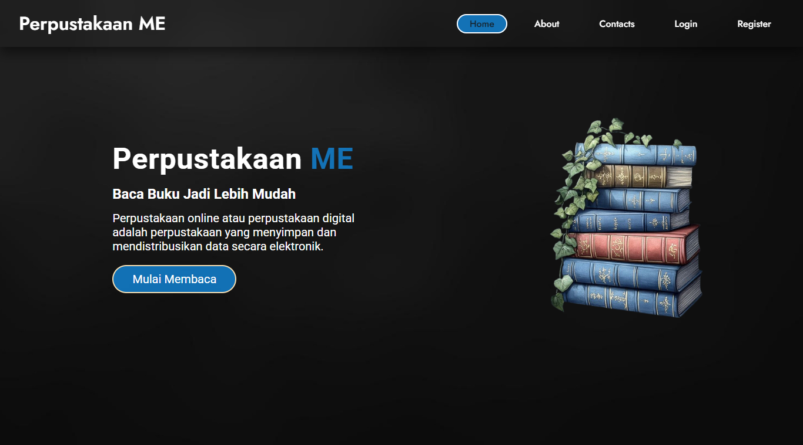

# 📚 Aplikasi Perpustakaan - Multi User Login

## 📝 Deskripsi

Aplikasi ini adalah **sistem perpustakaan** berbasis web yang saya buat menggunakan **PHP Native**, **HTML**, **CSS**, dan **MySQL**.  
Project ini mendukung **multi user login**, yaitu perbedaan hak akses antara **admin** dan **user biasa (anggota)**.

Project ini saya buat untuk mengasah kemampuan backend dan manajemen data, dan kini saya unggah ke GitHub sebagai bagian dari portofolio saya.

## 🎯 Fitur Aplikasi

- ✅ Login Multi User (Admin & User)
- ✅ Manajemen Buku (CRUD Buku)
- ✅ Manajemen Anggota (CRUD User - untuk admin)
- ✅ Peminjaman & Pengembalian Buku
- ✅ Dashboard Admin
- ✅ Validasi Formulir
- ✅ Logout & Session Handling
- ✅ Export Data ke PDF
- ✅ Export Data ke Excel

## 👥 Hak Akses User

| Role  | Akses Fitur                                                                 |
|-------|------------------------------------------------------------------------------|
| Admin | Kelola data buku, kelola user, lihat semua data, kelola peminjaman & laporan |
| User  | Lihat daftar buku, Lihat Detail Buku, pinjam buku, lihat status peminjaman mereka sendiri       |

## 🛠️ Teknologi

- **Backend:** PHP Native
- **Frontend:** HTML + CSS
- **Database:** MySQL
- **Server Local:** XAMPP / Laragon

## 🚀 Cara Menjalankan

1. **Clone Repo:**
   ```bash
   git clone https://github.com/usernamenuh/n4h-Aplikasi_Perpustakaan.git
   ```
2. **Pindahkan folder project ke `htdocs`** (jika menggunakan XAMPP).

3. **Jalankan XAMPP** (aktifkan Apache & MySQL).

4. **Import Database:**
   - Buka **phpMyAdmin** di browser.
   - Buat database baru, misal: `aplikasi-perpustakaan_db`.
   - Import file `aplikasi-perpustakaan.sql` dari folder project ke database tersebut.

5. **Akses Aplikasi di Browser:**
   ```
   http://localhost/n4h-Aplikasi_Perpustakaan/
   ```

## 📸 Dokumentasi Screenshot

### 🏠 Homepage


### 🔐 Halaman Login


### 🗂️ Dashboard Admin


### 📚 Daftar Buku


### 👥 Daftar Anggota


### 📖 Daftar Peminjaman


### 📊 Export


### 🧑‍💻 User Dashboard


### 🧭 Entity Relationship Diagram (ERD)


#### Penjelasan ERD

ERD di bawah ini menggambarkan struktur dan relasi antar tabel pada database aplikasi perpustakaan:

- **buku**  
  Menyimpan data buku yang tersedia di perpustakaan, seperti nama, pengarang, penulis, jumlah halaman, tanggal upload, jenis buku (Fiksi/Non Fiksi), stok, dan gambar.

- **anggota**  
  Menyimpan data anggota perpustakaan, seperti nama, NIM, nomor HP, email, tanggal lahir, tempat lahir, alamat, program studi, agama, jenis kelamin, dan foto.

- **admin**  
  Menyimpan data admin perpustakaan, seperti nama, email, dan foto.

- **login**  
  Menyimpan data login untuk autentikasi, berisi username, password, role (admin/user), serta relasi ke tabel `anggota` dan `admin`.

- **peminjaman_buku**  
  Menyimpan data transaksi peminjaman buku, seperti ID peminjaman, relasi ke buku dan anggota, tanggal pinjam, tanggal kembali, dan status peminjaman (dipinjam/dikembalikan).

**Relasi antar tabel:**
- Satu anggota bisa memiliki satu akun login (relasi `anggota` ke `login`).
- Satu admin juga memiliki satu akun login (relasi `admin` ke `login`).
- Satu anggota dapat melakukan banyak peminjaman buku (relasi `anggota` ke `peminjaman_buku`).
- Satu buku dapat dipinjam oleh banyak anggota (relasi `buku` ke `peminjaman_buku`).

Dengan struktur ini, aplikasi dapat mengelola data buku, anggota, admin, login, dan transaksi peminjaman dengan baik.


### 📱 Hubungi Saya

<p align="center">
  <a href="mailto:muhammadenuh03@gmail.com"></a>
  <a href="https://www.linkedin.com/in/muhammadenuh"></a>
  <a href="https://www.instagram.com/usernamenuh"></a>
  <a href="https://www.tiktok.com/@mhn4h"></a>
  <a href="https://www.youtube.com/@nuh11"></a>
</p>

### ☕ Dukung Karyaku

Jika kamu suka dengan apa yang saya buat dan ingin mendukung, silakan traktir saya kopi!
[](https://visitcount.itsvg.in)

[](https://buymeacoffee.com/muhammadena)